[![MIT License][license-shield]][license-url]

<br>
<p align="center">
  <h1 align="center">PyTorch Style Transfer</h1>

  <p align="center">
    More or less replicating <a href='https://arxiv.org/abs/1508.06576'> Gatys et al. 2015 </a> but not, like, exactly
</p>
<br>

<p align="center">
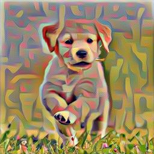</img>

## Usage
Install requirements with:

``` sh
pip install -r requirements.txt
```
Put the content and style images in the `img` folder and run

``` sh
./src/style.py [CONTENT IMAGE NAME] [STYLE IMAGE NAME] 
```

with additional flags:
```
[-g STEPS] [-s IMAGE_SIZE] [-l NUM_STYLE_LAYERS] 
[-r RANDOM INITIAL IMAGE] [-a ALPHA] [-b BETA] [-n NORMALIZE INPUT]
```

To get parameter descriptions and defaults, run:

``` sh
./src/style.py --help
```
Just FYI, there's plenty of better Pytorch implementations of Gatys et al. 2015 online, this one is not very well optimized or tested: I wrote it over a weekend to test my understanding of style transfer.  
<br>

## Gallery 

<p align="center">
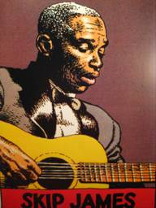
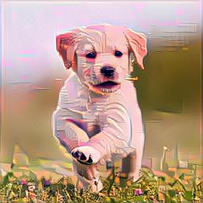
<br>

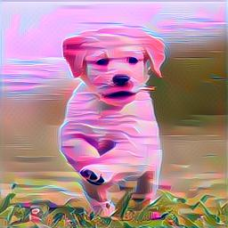
<br>

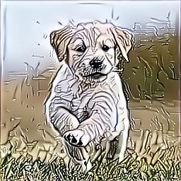
<br>
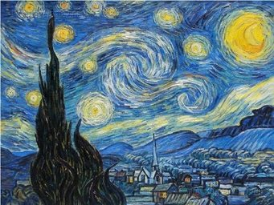
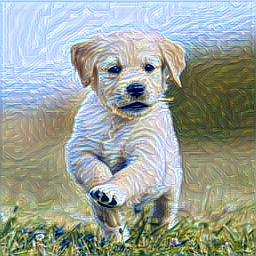
<br>

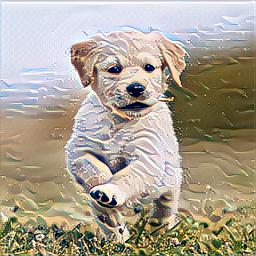
<br>
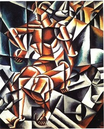
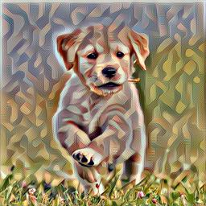
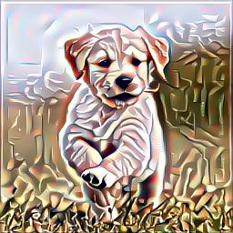
<br>
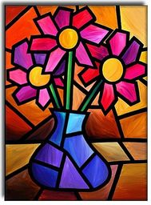
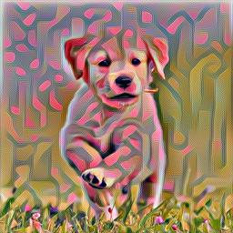
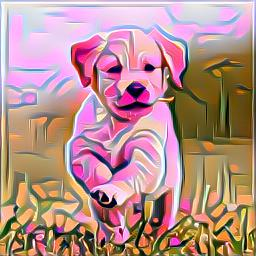
<br>

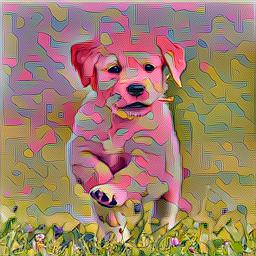
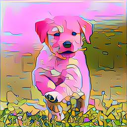
<br>
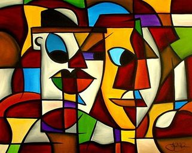

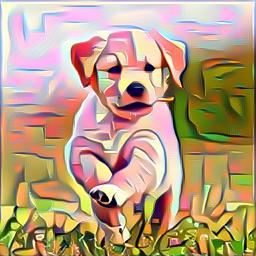
<br>

[license-shield]: https://img.shields.io/github/license/othneildrew/Best-README-Template.svg?style=flat-square
[license-url]: https://github.com/othneildrew/Best-README-Template/blob/master/LICENSE.txt